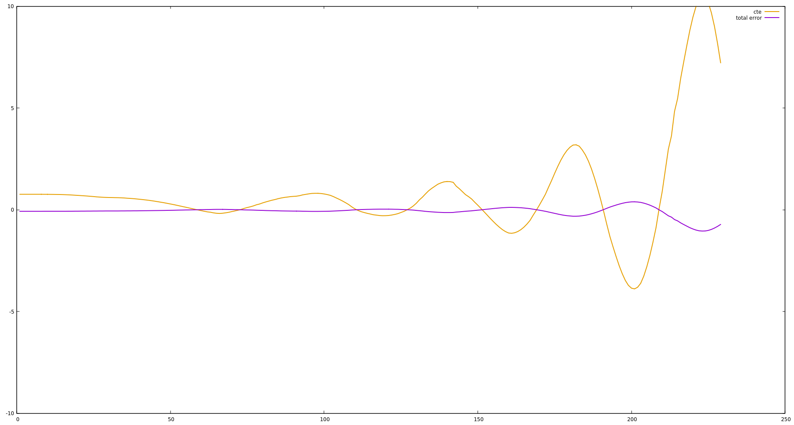
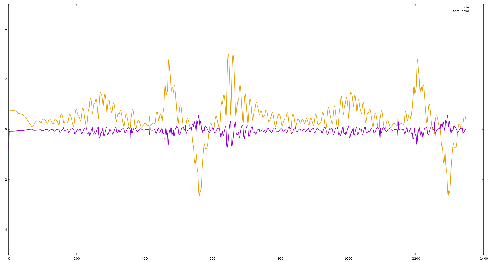
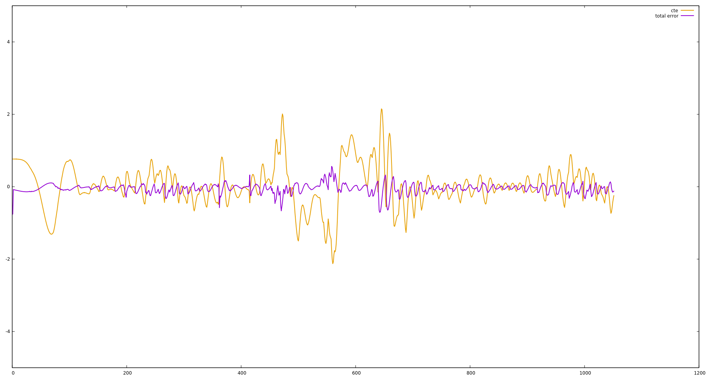

# PID Control Project 

This is my solution of Project 9 of Udacity's Self Driving Car Nanodegree. 

## Implementation

- [PID.cpp](./src/PID.cpp)
- [PID.h](./src/PID.h)
- [main.cpp](./src/main.cpp)

## Reflection

#### Describe the effect each of the P, I, D components had in your implementation.

|component|effect|
|:---:|---|
|P "proportional"|Steer in proportion to the cross track error, if the error is large, the steering angle gets large, it tends to overshoot, the oscillation will increase if the value is too high|
|D "differential"|Considers the rate of change in the error, prevents overshooting the center line|
|I "integral"|Counteracts a bias in the cross track error, which prevents the PD controller from reaching the center line|

The following graphs and videos show the effect of different hyperparameter values: 

---------
In the following plot you can see the cte (cross-track-error) and the steering angle (total_error) when using Kp=0.1

and this is how it looks like in the simulator: [Video](./media/kp_0p1_30mph.mp4?raw=true)

---------
In the following plot you can see the cte (cross-track-error) and the steering angle (total_error) when using Kp=0.1 and Kd=0.9

and this is how it looks like in the simulator: [Video](./media/kp_0p1_kd_0p9_30mph.mp4?raw=true)

---------
In the following plot you can see the cte (cross-track-error) and the steering angle (total_error) when using Kp=0.1, Kd=0.9 and Ki=0.005

and this is how it looks like in the simulator: [Video](./media/kp_0p1_kd_0p9_ki_0.005_30mph.m4v?raw=true)

#### Describe how the final hyperparameters were chosen.

I tuned the hyperparameters of the PID controller manually. First I started with only the proportional component as you can see in the images and the video above. In the next step I added the differential part, so the car gets around the track, but it was still unstable, especially after the first curve. I tuned these parameters so the car gets more stable. I added the integral component as well, but it had only a small impact on the track. Finally I get these hyperparameters by manually tuning:

|parameter|value|
|---|---|
|P|0.1|
|I|0.005|
|D|0.9|

With these parameters you get the car around the track. But there is still room for improvement. You can use for example an algorithm like twiddle to tune these parameters even more.

